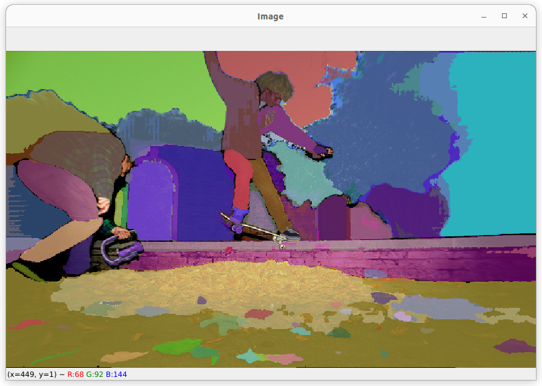

# Interactive Scene Segmentation
Interactive scene segmentation tool using Segment Anything

## Getting Started

### Prerequisites

- A graphic card that is compatible with cuda, see [compatible graphic cards](https://developer.nvidia.com/cuda-gpus)
- Anaconda, see [install Anaconda](https://docs.anaconda.com/free/anaconda/install/index.html)

### Set Up

- Download the repository
- Do:

    ``cd interactive_scene_segmentation``

    ``conda create --name iss python=3.11``

    ``conda activate iss``

    ``pip install -r requirements.txt``
- Download a pretrained model from Segment Anything, [vit_b](https://dl.fbaipublicfiles.com/segment_anything/sam_vit_b_01ec64.pth)

## Usage

Run user interface:

``python main.py --dir directory_with_training_images, --model path_to_model``

Run training:

``python train.py``

For adjusting parameters run:
``python train.py --help``

### Controls
- `1/2/3`->  to change the interaction type to "point"/ "area" / "polygon"
- `w/s` -> to segment finer/coarser
- `d`-> to save the image and get to the next one
- `q`-> to quit the program

## User Interface

## References

<a id="1">[1]</a> 
Kirillov, Alexander and Mintun, Eric and Ravi, Nikhila and Mao, Hanzi and Rolland, Chloe and Gustafson, Laura and Xiao, Tete and Whitehead, Spencer and Berg, Alexander C. and Lo, Wan-Yen and Dollär, Piotr and Girshick, Ross (2023). 
Segment Anything. 
arXiv:2304.02643.